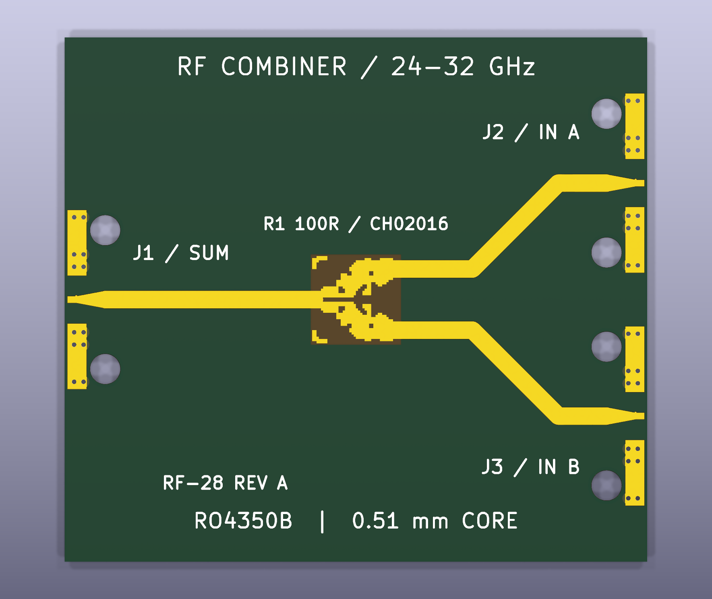

# 28 GHz two-way power divider / combiner

Experimental YAPNR inverse-designed microstrip Wilkinson coupon targeting the Knowles PDW07630's 24–32 GHz small-signal performance. **Revision A fails the return-loss and loss requirements in exported-footprint simulation. It is not a validated replacement for PDW07630.**



The 40 × 36 mm board uses a 0.51 mm RO4350B core, three Southwest Microwave 1092-03A-6 2.92 mm edge launches, equal-length output feeds and a 100 ohm Vishay CH02016 resistor. J1 is SUM, J2/J3 are the two inputs/outputs. The board shot is a KiCad render of the actual copper and mechanical lands; connectors and resistor are not installed in the render.

- [Requirements model](requirements/model.yaml): 3 user needs, 12 requirements and 4 verification methods.
- [Validation report](reports/validation.md): acceptance criteria, grid comparison and links to simulation results.
- [rules_requirements traceability](reports/traceability.md), [HTML](reports/traceability.html), [JSON](reports/traceability.json), [gap queue](reports/gaps.json).
- [KiCad PCB](output/test-board/rf-combiner-test.kicad_pcb), [project](output/test-board/rf-combiner-test.kicad_pro), [BOM](output/test-board/BOM.csv).
- [Fabrication ZIP](output/test-board/rf-combiner-revA-fabrication.zip), [fabrication/assembly notes](FABRICATION.md). Layout DRC passes; RF acceptance does not.
- [Exported RF footprint](runs/jlc20mil/footprint.kicad_mod), [simulation metrics](runs/jlc20mil/comparison.json), [artifact hashes](reports/artifact-manifest.json).

## Requirements and sources

The baseline is the [Knowles datasheet](https://www.knowlescapacitors.com/getattachment/Products/Microwave-Products/Power-Dividers/PDW07630_DATASHEET.pdf?lang=en-US), preserved as [reference PDF](reference/PDW07630_DATASHEET.pdf): 24–32 GHz, return loss ≥15 dB, isolation ≥14 dB, excess insertion loss ≤0.7 dB, amplitude balance ±0.5 dB, phase balance ±5°. The combiner is specified for equal-amplitude, equal-phase inputs. Its 5 W combining rating is not qualified for this coupon.

The workflow follows [YAPNR RF inverse design](https://studio-fug.github.io/yapnr/docs/rf-inverse-design.html). The user's final stackup selection superseded the earlier 10 mil option: **0.51 mm core and 2.92 mm launches**. A larger board footprint was accepted. [spec.json](spec.json) holds stricter optimization goals (20 dB return loss, 17 dB isolation, 0.5 dB excess loss); [requirements/model.yaml](requirements/model.yaml) retains the datasheet minimum acceptance thresholds.

## Reproduction

Docker is required for RF simulation. YAPNR is an external dependency, pinned by [upstream image digest, Git revision and archive checksum](dependencies/yapnr.json). The run scripts build a cached runtime image from [Dockerfile](Dockerfile), fetching upstream source during the build; no YAPNR source is vendored in this repository. The upstream image includes Torch 2.3.1 and the native FDTD backend, but its wheel omits `yapnr.rf.export` ([upstream issue #96](https://github.com/Studio-Fug/yapnr/issues/96)). Until that packaging defect is fixed, the derived image loads the complete pinned upstream Python package from `/opt/yapnr-dependency`, retaining the base image's matching native solver. This is a temporary source-dependency workaround, not a `pip install git+...` installation. Build-time imports and native-source checks fail if the dependency is incomplete or mismatched. Containers are bounded to two CPU cores and 6 GB RAM. The first build needs network access; later builds reuse Docker layers.

```sh
./run-container.sh > optimization.log 2>&1
./run-validation.sh > validation.log 2>&1
```

The committed run contains the checkpoint, optimization history, exported footprint, full complex S-parameter sweeps and mesh masks. Rerunning optimization resumes the checkpoint; move `runs/jlc20mil` aside first for a fresh run. Validation simulates the exported polygons on 0.15, 0.075 and 0.05 mm lateral grids with 4, 6 and 8 substrate cells. Each validation sweep has 81 frequencies from 24 to 32 GHz and 50 ohm reference impedance at the DUT boundary planes. The complete fixture is not included in that simulation.

To regenerate the requirements report with Python 3.9+:

```sh
python3 -m venv .venv
. .venv/bin/activate
pip install -r requirements/requirements.txt
./scripts/report.sh
```

`--fail-on none` permits report generation with known design failures; it does not change their verdicts. Each evidence case owns exactly one requirement. The verification lock pins the expected case sets; the evidence records simulation file paths and SHA-256 hashes.

Build the PCB using KiCad 10's `pcbnew` Python bindings, then run native DRC:

```sh
python3 build_board.py runs/jlc20mil/footprint.kicad_mod
kicad-cli pcb drc --exit-code-violations --format json \
  --output output/test-board/drc.json output/test-board/rf-combiner-test.kicad_pcb
```

The build converts the continuous multi-terminal footprint graphic to a custom-pad primitive without changing its polygon coordinates, enabling KiCad's connectivity checks. The three microwave port numbers share a DC net, as expected for a Wilkinson copper island.

## Timing

[timing.json](output/timing.json) records the available first-prompt timestamp, optimizer duration, completion of validation, and repository delivery. The first-prompt timestamp may have been replayed on restart; any earlier unrecorded interval is excluded. Completing a validation procedure does not mean the design passed validation.

## Third-party material

YAPNR is an external AGPL-3.0 dependency; its source and license are available in the [upstream repository](https://github.com/Studio-Fug/yapnr). Manufacturer documents retain their respective copyrights. Tool revisions and image digest are recorded in [dependencies/yapnr.json](dependencies/yapnr.json) and [result.json](runs/jlc20mil/result.json). The initial simulations used a local snapshot of the same revision. Every Python module was byte-compared with the fetched upstream source and matched, and the native source hash also matches; historical simulation artifacts are unchanged.

A plot of the recorded validation sweeps is in [simulation-comparison.png](reports/simulation-comparison.png); regenerate it with `python3 scripts/plot_results.py` after installing NumPy and Matplotlib.

To verify that the external dependency reproduces the original simulation, run:

```sh
./scripts/build-runtime.sh
docker run --rm --cpus 2 --memory 6g -v "$PWD:/project" -w /tmp \
  -e OPENBLAS_NUM_THREADS=1 -e OMP_NUM_THREADS=2 -e YAPNR_RF_THREADS=2 \
  -e YAPNR_RF_REQUIRE_NATIVE=1 --entrypoint python3 \
  28ghz-divider-rf:57df5897-1 -u /project/scripts/check_dependency.py
```

[Recorded dependency check](reports/dependency-smoke.json) compares the full complex coarse-grid S matrix, with exact equality required.
