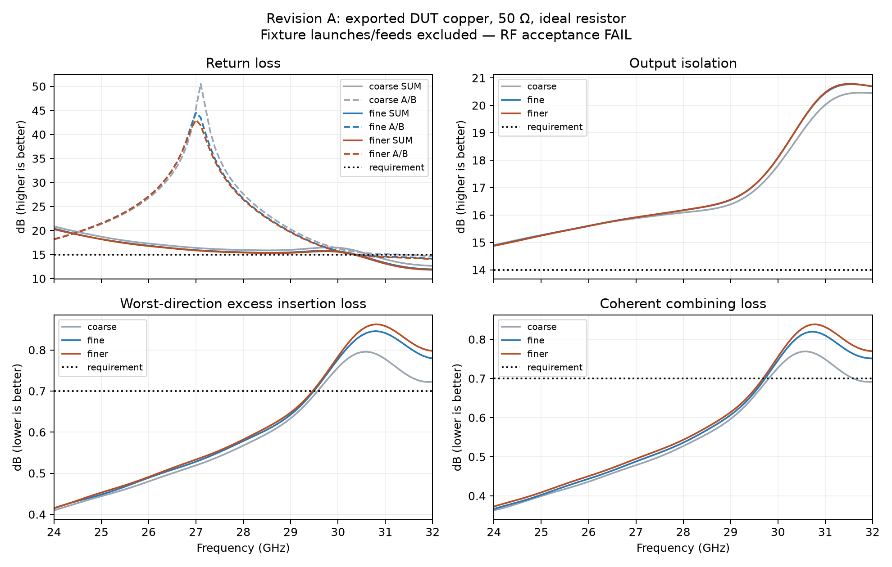

# Validation of revision A

**Overall disposition: FAIL — experimental small-signal coupon; PDW07630 equivalence is not established.**

**Whole-assembly validation is BLOCKED and has not run.** See [assembly status](assembly-validation.json) and the mandatory [project spec](../spec.json). DUT-only results cannot release the populated board.

The numerical results below assess only the exported DUT copper, not the populated assembly or only the optimizer's density model. Its results supersede the earlier optimizer summary. The reference planes are the three design-window boundaries, with 50 ohm renormalization, not the fixture connectors. Each sweep has 81 points over 24–32 GHz.

| Grid | Pitch mm | Worst return loss dB (>=15) | Isolation dB (>=14) | Excess loss dB (<=0.7) | Coherent combining loss dB (<=0.7) | Result |
|---|---:|---:|---:|---:|---:|---|
| coarse | 0.150 | 12.644 | 14.901 | 0.796 | 0.769 | FAIL |
| fine | 0.075 | 11.929 | 14.890 | 0.846 | 0.820 | FAIL |
| finer | 0.050 | 11.823 | 14.875 | 0.862 | 0.838 | FAIL |

The grid-by-grid data and individual-port metrics are in [comparison.json](../runs/jlc20mil/comparison.json). Raw simulation results: [coarse Touchstone](../runs/jlc20mil/coarse-validated.s3p), [fine Touchstone](../runs/jlc20mil/fine-validated.s3p), [finer Touchstone](../runs/jlc20mil/finer-validated.s3p). The corresponding NPZ files preserve complex S matrices, frequencies and rasterized copper. [Validation log](../validation.log) records mesh runtimes and backend. [validate_design.py](../validate_design.py) defines the procedure and acceptance thresholds. [Evidence XML](testlogs/validation/test.xml) references each simulation file by path and SHA-256, with one requirement per case.

Return loss and excess loss fail on the completed grids. Isolation, amplitude balance, phase balance and passivity pass. Mirror symmetry enforces nearly exact balance in this ideal model; it does not establish manufactured balance. Grid refinement is sensitivity evidence, not an assertion that the simulation is converged or matches hardware.

The optimizer used more demanding targets (20 dB return loss, 17 dB isolation, 0.5 dB excess loss) and did not meet them. It completed 73 iterations and mechanically selected iteration 25. See [optimizer result](../runs/jlc20mil/result.json), [history](../runs/jlc20mil/history.json) and [optimization log](../optimization.log). Its internal response differs from exported-polygon re-simulation; no claim is made that the export preserves the internal model's electrical response.

## Dependency reproducibility

YAPNR is fetched as a pinned external dependency ([declaration](../dependencies/yapnr.json), [Dockerfile](../Dockerfile)). The original image omits RF export modules; [upstream issue #96](https://github.com/Studio-Fug/yapnr/issues/96) tracks the packaging fix. [Dependency smoke check](dependency-smoke.json) re-runs the coarse sweep outside the source checkout and compares its complex S matrix with the original committed simulation. The simulation artifacts and RF acceptance failures are unchanged.

## Board verification

[Native KiCad 10.0.6 DRC](../output/test-board/drc.json): zero violations and zero unconnected items. This verifies layout rules and DC connectivity, not microwave performance. The main footprint polygon is represented as a custom-pad primitive in the board so it participates in KiCad connectivity; its polygon coordinates are preserved (verified by [exact coordinate comparison](board-geometry.json), including floating islands). [Board builder](../build_board.py) records this conversion. The optimized footprint's own minimum-width/space check is in result.json under drc.

## Limitations and outstanding validation

- Ideal 100 ohm lumped resistor; no CH02016 package or solder parasitics.
- Zero-thickness smooth copper sheet; no ENIG, copper roughness, plating variation or manufacturing tolerance model.
- Infinite substrate and ground approximation; fixture traces, connector launches, mounting holes and board edges are excluded from RF simulation.
- No measured S parameters, calibrated fixture de-embedding, power handling or thermal qualification. The 5 W combining rating of the reference part is not established for this coupon.
- JLC material availability and finished stackup must be confirmed when quoting. Connector mounting and resistor land compatibility require assembly review.

The rules_requirements [traceability report](traceability.md), [machine report](traceability.json), [HTML report](traceability.html) and [gap queue](gaps.json) preserve failures and unverified bench requirements. Passing simulation evidence has simulation rigor only; it does not verify the complete fixture.
